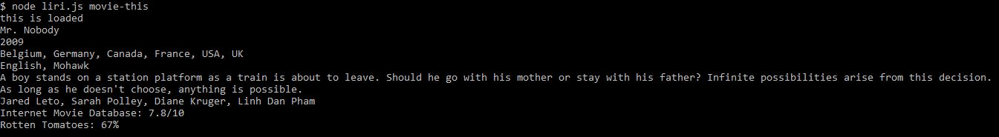

<h1>Liri Node App</h1>

Easily search for concerts, songs, or movies using your Terminal.

Release 1.1 MVP CLI app:



This is a CLI app, so it's not deployed to GitHub pages. To use it, please download the code published here in this repository.

After downloading the files contained in this repository, you'll also need to:

* Create your Client ID at [Spotify](https://developer.spotify.com/my-applications/#!/);
* Open your terminal and navigate to the local folder that contains the files downloaded here. 
* Run `touch .env` to create a file named ".env".
* Inside the ".env" file, include these lines:

```js

# Spotify API keys

SPOTIFY_ID=your-spotify-id
SPOTIFY_SECRET=your-spotify-secret

```

* In the Terminal, run `npm init`.
* Then, run each of the following commands:
- npm install node-spotify-api
- npm install axios
- npm install moment
- npm install dotenv


<h2>MVP</h2>
Phase One: Run API Search and filter response.
Phase Two: Define what each search will run in case the user does not specify a query.
Phase Three: Confirm errors are being caught and handled, if thrown.

<h2>Project Management</h2>
[Project Board](https://github.com/amandalragone/liri-node-app/projects/1)

<h2>How to use this app</h2>
1. Open Terminal.
2. Navigate to the folder where the code is stored. (For example: `cd <Documents>/<my-repository>` )
3. Run a search:
- To search for a movie, run `node liri.js movie-this <your-movie>`.
- To search for a song, run `node liri.js spotify-this <your-song>`.
- To search for a concert, run `node liri.js concert-this <your-artist/band>`.

<h2>Future Direction</h2>
- Create a log file whenever a search runs in the Terminal will be the next release.